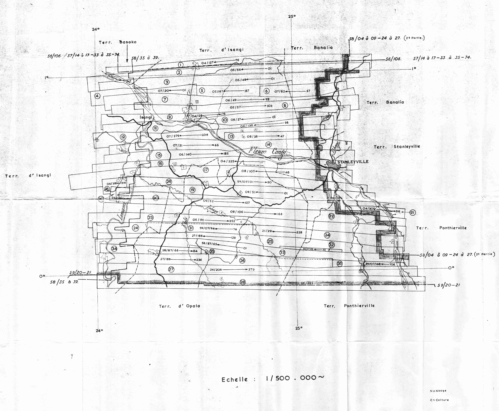
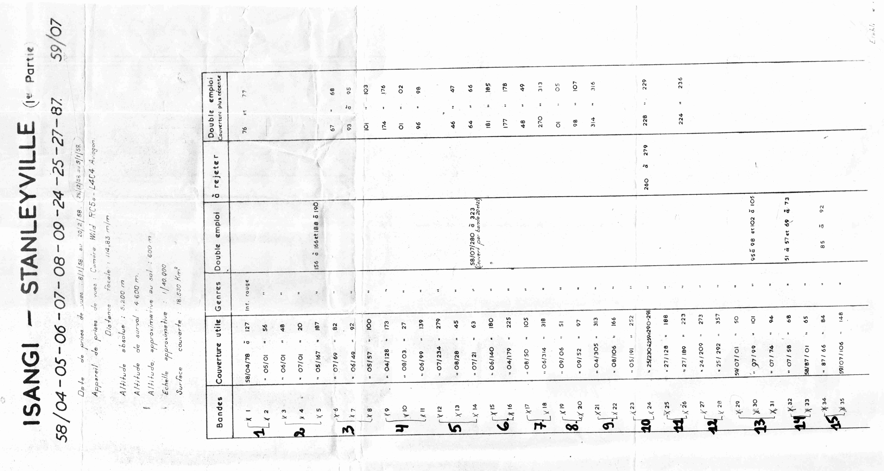
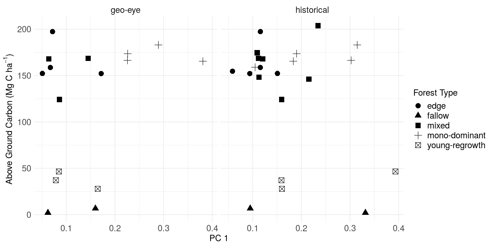
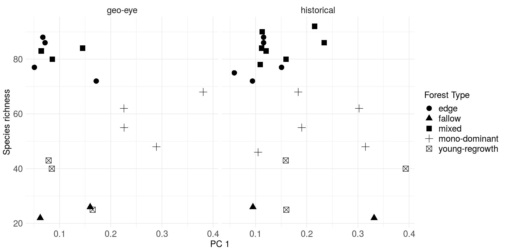
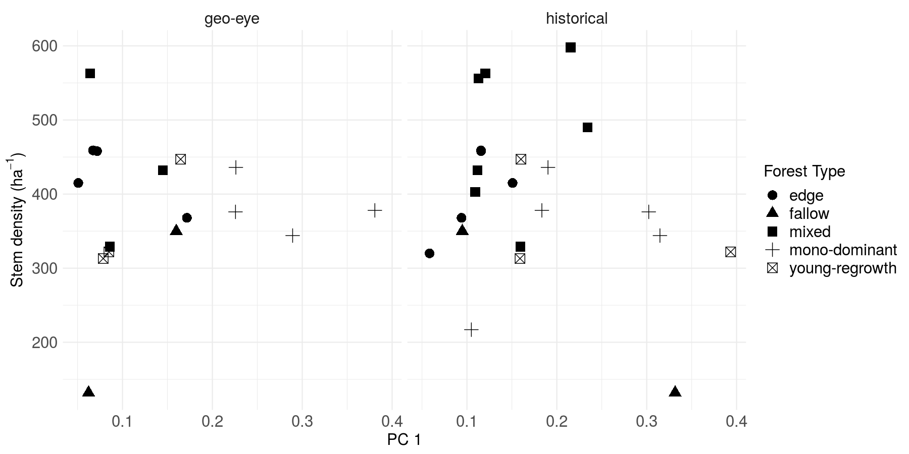

---
header-includes:
  - \usepackage{setspace}
  - \doublespacing
  - \usepackage{lineno}
  - \usepackage[width=\textwidth]{caption}
output:
  pdf_document:
    fig_caption: yes
    keep_tex: yes
    number_sections: no
  html_document:
    fig_caption: yes
    force_captions: yes
    number_sections: yes
classoption: landscape
---

```{r setup, include=FALSE, message=FALSE}
  knitr::opts_chunk$set(echo = TRUE)
  library(orthodrc)
  library(landscapemetrics)
  library(raster)
  library(ggplot2)
  library(ggthemes)
  library(tidyverse)
  library(knitr)
  library(kableExtra)

  r <- raster("../data/orthomosaic/yangambi_forest_cover_difference_1958_2000.tif")

  # read site data
  psp <- read.table("../data/surveys/site_characteristics.csv",
                    header = TRUE,
                    sep = ",")
  
  # Define lat / lon projection.
  lat_lon <- CRS("+init=epsg:4326")

  # Read in the coordinates and assign them a projection
  ll <- sp::SpatialPoints(cbind(psp$lon,psp$lat), lat_lon)
  
  # stuff results into original dataframe
  lulcc_px <- raster::extract(r, ll, buffer = 100)
  
  psp$lulcc_summary <- lapply(lulcc_px, function(x){
    s <- table(x)
    s <- round(s/sum(s)*100)
    n <- names(s)
    paste(paste(s," (",n,")", sep = ""), collapse = ", ")
  })
  
  # flight data
  flight_data <- read.table("../data/orthomosaic/flight_path_meta-data.csv",
                    header = TRUE,
                    sep = ",")

  # select classes into their respective time frame
  historical <- (r == 2 | r == 4)
  contemporary <- (r == 3 | r == 4)
  
  # reproject to meter based mercator projection
  # should be fine around the equator
  historical <- projectRaster(historical,
                              crs = "+init=epsg:3395",
                              method = "ngb")
  
  contemporary <- projectRaster(contemporary,
                              crs = "+init=epsg:3395",
                              method = "ngb")
  
```

# Appendix

```{r echo = FALSE, eval = TRUE}
psp %>%
  select(-c("label")) %>%
  kable(
    caption="Site description of all the current permanent sampling plots in the greater Yangambi region. We list the forest type, plot number, geographic location (in decimal degrees), stem density, basal area Above Ground Carbon (AGC), species richness and Land-Use and Land-Cover Change (LULCC) classes in a radius of 100m around each plot location.",
    booktabs = TRUE,
    escape = FALSE,
    col.names = c(
         "type",
         "nr",
         "latitude",
         "longitude",
         "stem density ($ha\\textsuperscript{-1}$)",
         "basal area ($m\\textsuperscript{2}$ $ha\\textsuperscript{-1}$)",
         "AGC (Mg C $ha\\textsuperscript{-1}$)",
         "species richness",
         "LULCC class coverage (\\%)")) %>%
  kable_styling(latex_options = c("hold_position"))
```

```{r echo = FALSE, eval = TRUE}
flight_data %>%
  kable(
    caption="Flight path meta-data for the Isangi-Stanleyville aerial survey. Data provided consists of the flight path number, cardinal direction of the flight, the image numbers, and the duration of the flight provided by the start and end time of the acquisition. Data is sourced from Appendix Figure 2 and the sensor logs recorded in the margin of acquired images (see Figure 1 main manuscript).",
    booktabs = TRUE,
    escape = FALSE,
    col.names = c("path",
                  "direction",
                  "image \\#",
                  "start (H:M:S)",
                  "end (H:M:S)")
    ) %>%
  kable_styling(latex_options = c("hold_position"))
```

\pagebreak

```{r echo=FALSE, out.width='100%', fig.cap="Overview of the complete flight plan of the survey around Kisangani (then Stanleyville) stored in the archives at the Africa Museum."}

```

\pagebreak

```{r echo=FALSE, out.height='75%', fig.cap="Overview of the complete flight plan meta-data as stored in the archives at the Africa Museum."}

```

\pagebreak

```{r echo=FALSE, out.height='50%', fig.cap="Boxplots comparing the first principal component (PC1) of a site based FOTO analysis across different forest types for both contemporary (Geo-Eye) and historical orthomosaic data."}
knitr::include_graphics('./figures/foto_bplot_psp.png')
```

```{r echo = FALSE, out.width="75%", eval = TRUE, fig.cap="Scatterplot comparing Above Ground Carbon and the first principal component of the FOTO analysis for contemporary Geo-Eye (left) and the historical orthomosaic (right) data. Different forest types are plotted using closed circles, closed triangles, closed squares and this for fallow, mixed mon-dominant and young-regrowth forests, respectivelly "}

```

```{r echo = FALSE, out.width="75%", eval = TRUE, fig.cap="Scatterplot comparing tree species richness and the first principal component of the FOTO analysis for contemporary Geo-Eye (left) and the historical orthomosaic (right) data. Different forest types are plotted using closed circles, closed triangles, closed squares and this for fallow, mixed mon-dominant and young-regrowth forests, respectivelly"}

```

```{r echo = FALSE, out.width="75%", eval = TRUE, fig.cap="Scatterplot comparing stem density (per ha) and the first principal component of the FOTO analysis for contemporary Geo-Eye (left) and the historical orthomosaic (right) data. Different forest types are plotted using closed circles, closed triangles, closed squares and this for fallow, mixed mon-dominant and young-regrowth forests, respectivelly"}

```

\pagebreak

```{r echo=FALSE, out.height='75%', fig.cap="CNN classifier results as run on a recent (2012) Geo-Eye panchromatic image. Results are compared with the Landsat based ."}
knitr::include_graphics('./figures/visual_comparison_classifiers.png')
```

```{r echo = FALSE, eval = TRUE}
# this data will not be available in the github repo due to missing geo-eye data

# read in cnn forest mask
m <- raster("../data/geo-eye/geo-eye_forest_mask_cnn.tif")

# hansen
hans <- raster("../data/Hansen_et_al/Hansen_GFC_lossyear_yangambi.tif")

# read in Hansen map (get all forest loss before 2013)
hans <- raster("../data/Hansen_et_al/Hansen_GFC_lossyear_yangambi.tif")
hans <- crop(hans, extent(m))
loss <- (hans <= 12) + (hans == 0)
loss <- (loss > 1)

ct <- crosstab(m, loss)
ct <- round(ct/sum(ct),2)
rownames(ct) <- c("non-forest","forest")

ct %>%
   kable(
    caption="Contingency table between the two forest / non-forest maps generated from a Geo-Eye 1 pan-chromatic image using a Convolutional Neural Network (CNN) generated and the Global Forest Cover map (Hansen et al. 2013).",
    booktabs = TRUE,
    col.names =  c("non-forest","forest")) %>%
  add_header_above(c("CNN" = 1, "Global Forest Cover" = 2)) %>%
  kable_styling(latex_options = c("hold_position"))

```

