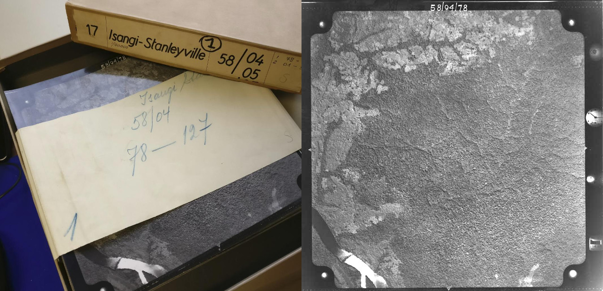
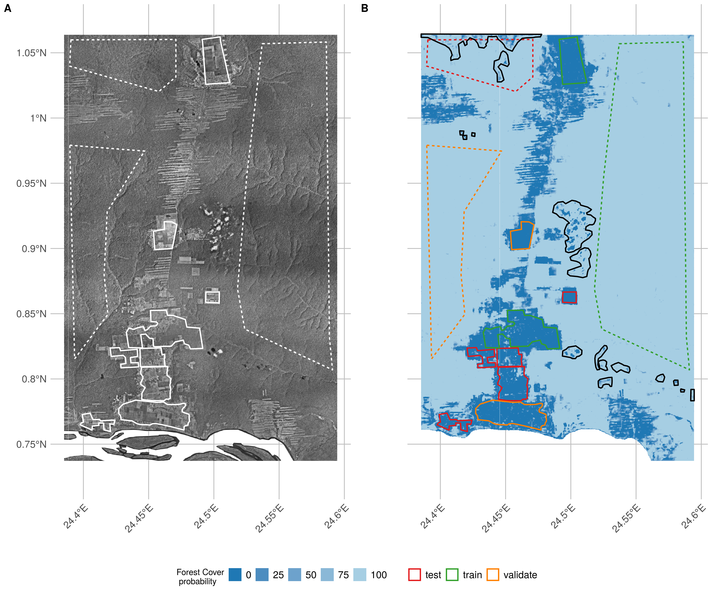
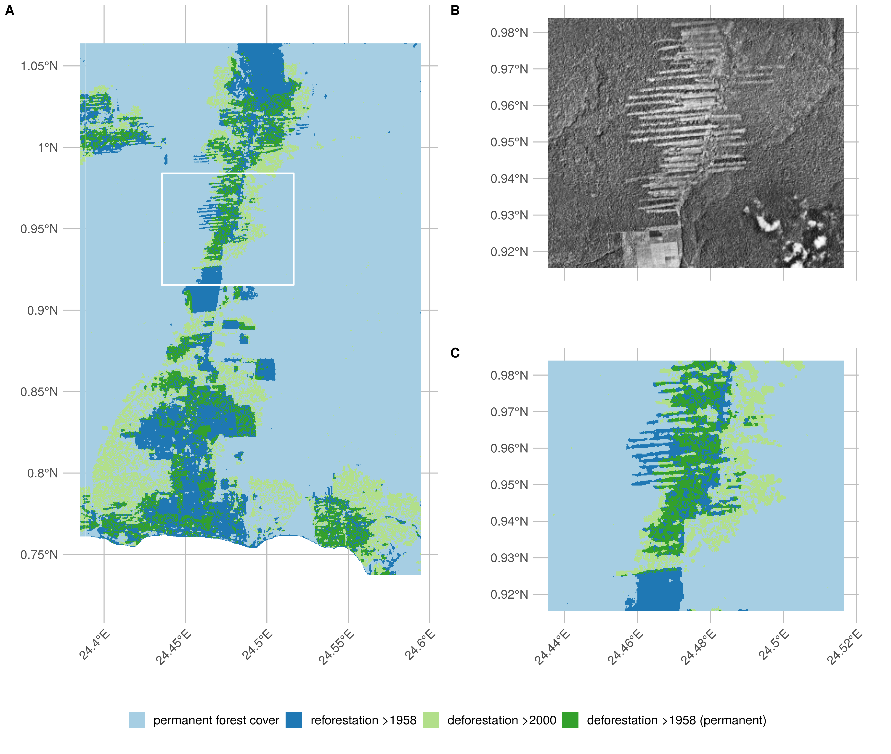
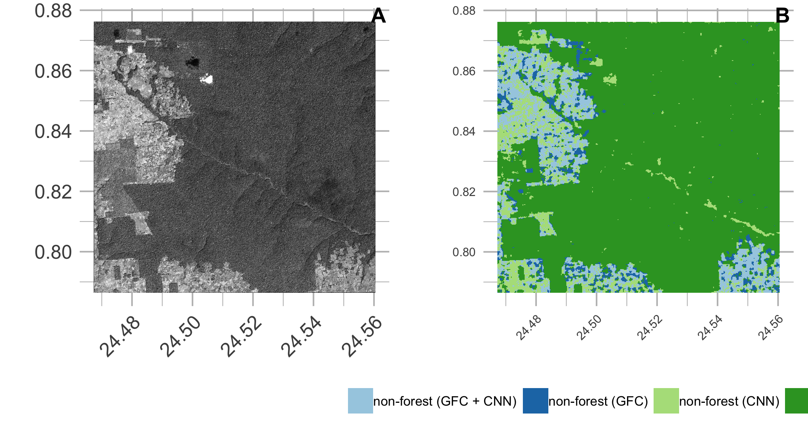
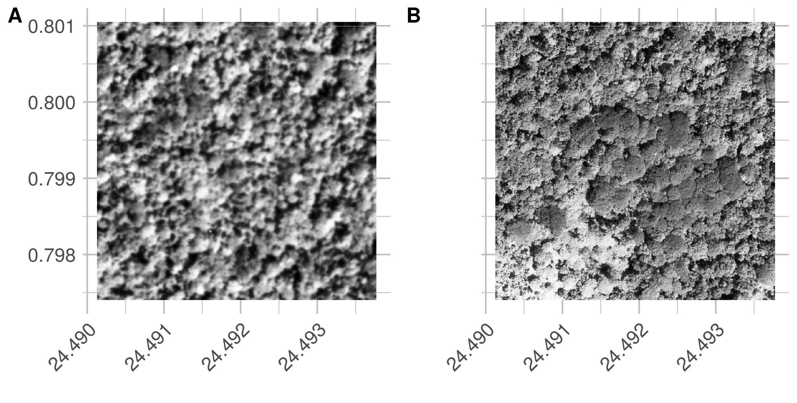
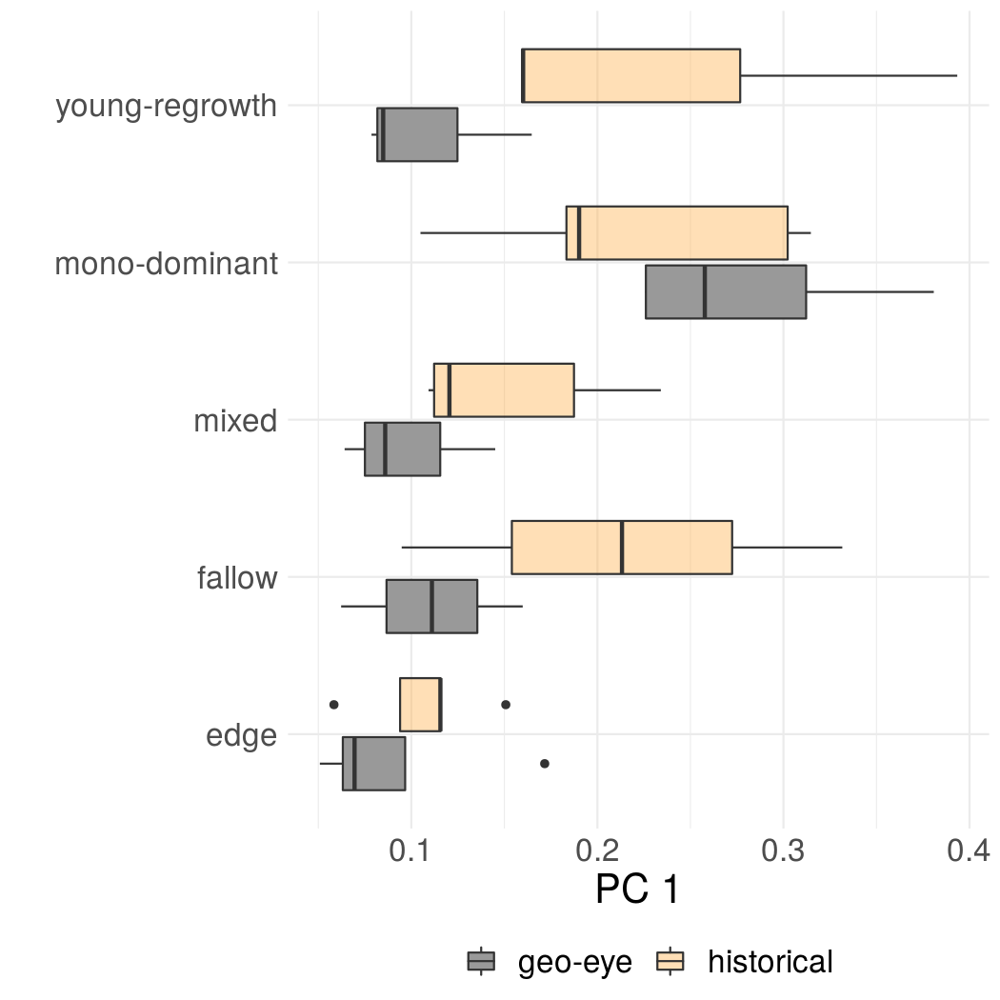

```{r setup, include=FALSE, message=FALSE, warning=FALSE}
  knitr::opts_chunk$set(echo = TRUE)
  library(raster)
  library(sf)
  library(rgdal)
  library(ggplot2)
  library(ggthemes)
  library(tidyverse)
  library(knitr)
  library(kableExtra)
  library(landscapemetrics)

  # set kable NA values to blank
  options(knitr.kable.NA = '')

  # landscape stats function
  landscape_stats <- function(r){

  df <- lsm_p_perim(r) %>%
    filter(class == 1) %>%
    select(-c(metric)) %>%
    rename(perimeter = value)

  df$perimeter <- df$perimeter
  
  area <- lsm_p_area(r) %>%
    filter(class == 1) %>%
    select(value) %>%
    rename(area = value)

  frac <- lsm_p_frac(r)  %>%
    filter(class == 1) %>%
    select(value) %>%
    rename(fractal_index = value)

  df <- data.frame(df, area = area, frac = frac)
  df$pa_ratio <- df$perimeter/(df$area*(100*100))

  df <- df %>%
    filter(area > 1,
           area < quantile(area, 0.95)) %>%
    summarize(
      perimeter = paste0(
        round(mean(perimeter),2),
        " $\\pm$ ",
        round(sd(perimeter),2)),
      area = paste0(
        round(mean(area), 2),
        " $\\pm$ ",
        round(sd(area), 2)),
      ratio = paste0(
        round(mean(pa_ratio), 2),
        " $\\pm$ ",
        round(sd(pa_ratio), 2)),
      fractal = paste0(
        round(mean(fractal_index), 2),
        " $\\pm$ ",
        round(sd(fractal_index), 2))
    )

  return(df)
}
  
  # read data
  change_map <- raster("../data/orthomosaic/yangambi_forest_cover_difference_1958_2000.tif")
  # 
  # read site data
  psp <- read.table("../data/surveys/site_characteristics.csv",
                    header = TRUE,
                    sep = ",")

  # patch metrics
  # select classes into their respective time frame
  historical <- (change_map == 2 | change_map == 4)
  contemporary <- (change_map == 3 | change_map == 4)
  
  # reproject to meter based mercator projection
  # should be fine around the equator
  historical <- projectRaster(historical,
                              crs = "+init=epsg:3395",
                              method = "ngb")
  
  contemporary <- projectRaster(contemporary,
                              crs = "+init=epsg:3395",
                              method = "ngb")
  
  patch_metrics <- rbind(landscape_stats(historical),
                 landscape_stats(contemporary))
  
  row.names(patch_metrics) <- c("historical","contemporary")
  
  # read change stats
  change_stats <- read.csv2("../data/surveys/lulcc_change_stats.csv",
                            header = TRUE,
                            sep = ",",
                            stringsAsFactors = FALSE)
  change_stats[1:2,3] <- NA

  # drop square km values per reviewer request
  change_stats <- change_stats[,2:3]
  
  # total non-forest 1958
  change_stats <- rbind(
    c(sum(change_stats$ha[c(3,5)]), NA),
                        change_stats)
  # total scene area
  change_stats <- rbind(
    c(sum(as.numeric(change_stats$ha[c(2,4:6)])), NA),
    change_stats)
  
  row.names(change_stats) <- c(
   "Total scene area",
   "Non-forest cover (1958)",
   "Forest cover",
   "  -  of which forest edges",
   "reforestation >1958",
   "deforestation >2000",
   "deforestation >1958 (permanent)")
    
# this data will not be available in the github repo due to missing geo-eye data

# read in cnn forest mask
m <- raster("../data/geo-eye/geo-eye_forest_mask_cnn.tif")

# hansen
hans <- raster("../data/Hansen_et_al/Hansen_GFC_lossyear_yangambi.tif")

# cloud mask
cloud_mask <- st_read("../data/maps/geo_eye_cloud_mask.shp")

# read in Hansen map (get all forest loss before 2013)
hans <- raster("../data/Hansen_et_al/Hansen_GFC_lossyear_yangambi.tif")
hans <- crop(hans, extent(m))
loss <- (hans <= 11) + (hans == 0)
loss <- (loss > 1)

# mask clouds
m <- mask(m, cloud_mask, inverse = TRUE)
loss <- mask(loss, cloud_mask, inverse = TRUE)

ct <- crosstab(m, loss)
ct <- round(ct/sum(ct) * 100,2)
rownames(ct) <- c("non-forest","forest")

# read in shapefile location digitized in QGIS
loc <- st_read("../data/cnn/sample_locations.shp")
disturbed <- loc %>% select(type) %>% filter(type == "dist")
forest <- loc %>% select(type) %>% filter(type == "forest")

# forest cover map
r <- raster("../data/orthomosaic/yangambi_forest_mask_qa_resampled.tif")
r <- (r > 0.5) * 1
r[is.na(r)] <- 3

# calculate the stats for the whole raster
forest_stats <- as.data.frame(na.omit(freq(mask(r, forest))))
forest_stats$count <- round(forest_stats$count/sum(forest_stats$count) * 100,2)

disturbed_stats <- as.data.frame(na.omit(freq(mask(r, disturbed))))
disturbed_stats$count <- round(disturbed_stats$count/sum(disturbed_stats$count) * 100,2)

valstats <- cbind(disturbed_stats$count, forest_stats$count)
rownames(valstats) <- c("non-forest","forest")

# calculate the stats for the validation
# area only
validation_forest <- loc %>%
  filter(cnn == "validate",
         type == "forest") %>%
  select(type)

validation_non_forest <- loc %>%
  filter(cnn == "validate",
         type == "dist") %>%
  select(type)

forest_stats <- as.data.frame(na.omit(freq(mask(r, validation_forest))))
forest_stats$count <- round(forest_stats$count/sum(forest_stats$count) * 100,2)

# add a row if forest cover is 100% accurate
# messes with table otherwise
if(forest_stats$count[1] == 100){
  if(forest_stats$value == 1){
   forest_stats <- rbind(c(0,0),forest_stats)
  }
}

disturbed_stats <- as.data.frame(na.omit(freq(mask(r, validation_non_forest))))
disturbed_stats$count <- round(disturbed_stats$count/sum(disturbed_stats$count) * 100,2)

valstats_subset <- cbind(disturbed_stats$count, forest_stats$count)

acc_ct <- sum(diag(ct))/sum(ct)
acc_valstats <- sum(diag(valstats))/sum(valstats)
acc_valstats_subset <- sum(diag(valstats_subset))/sum(valstats_subset)

acc <- round(c(NA,acc_ct,NA,acc_valstats,NA,acc_valstats_subset)*100,2)
valstats <- cbind(ct, valstats, valstats_subset)
valstats <- rbind(valstats, acc)
rownames(valstats) <- c("non-forest","forest","")

```

# Introduction

Tropical ecosystem services are severely impacted by deforestation and forest degradation [@hansen2013; @houghton2012; @tyukavina2015]. Not only does tropical forest Land-Use and Land-Cover Change (LULCC) constitute 10 to 15% of the total global carbon emissions [@vanderwerf2009], changes in forest fragmentation affect the forest structure and function [@fauset2017; @brinck2017; @didham1999]. Strong fragmentation effects decrease the number of large trees along forest edges [@laurance2000; @magnago2015], while species composition and biodiversity are equally negatively affected [@poorter2006; @barlow2016; @vandeperre2018]. Estimates show that 31% of carbon emissions are caused by edge effects alone [@brinck2017].

Accurate estimates of LULCC and forest canopy structure are therefore imperative to estimate carbon emissions and other ecosystem services [@houghton2012; @hansen2013]. Remote sensing products have been key inputs in LULCC assessments as they provide accurate spatial information to help estimate carbon emissions [@mitchard2018; @hansen2013]. More so, high resolution aerial images provide scientists tools to monitor forest extent, structure and carbon emissions as canopy texture is linked to above ground biomass [@Ploton2012; @Couteron2005; @Barbier2010]. Yet, most of these estimates are limited in time to recent decades [@defries2002; @houghton2012; @hansen2013; @achard2014].

Historical estimates of Land-Use and Land-Cover (LULC), in the pre-satellite era (< 1972), exist but generally rely on non-spatially explicit data (i.e socio-economic data) [@houghton2012; @ramankutty1999; @defries2002; @sader1988]. Efforts have been made to use other geo-spatial data sources such as historical maps [@willcock2016], declassified CORONA satellite surveillance data across the US and central Brazil [@song2015] as well as aerial surveys in post World War II Germany [@nita2018]. Survey data across the African continent is less common, inaccessible or both. Some studies do exist, as @buitenwerf2012 and @hudak1998 used aerial survey images to map vegetation changes in South African savannas, whilst @frankl2015 and @nyssen2016 mapped the Ethiopian highlands of 1930s.

Across the central Congo Basin most of these historical images were collected within the context of national cartographic efforts by the "Institut Géographique du Congo Belge" in Kinshasa (then Léopoldville), DR Congo. Despite the existence of large archives of aerial survey imagery of African rainforest (Figure 1, Appendix Figure 3), as of yet, no studies have valorized these data. The lack of a consistent valorization effort is unfortunate as the African rainforest is the second largest on Earth and covers ~630 million ha, representing up to 66 Pg of carbon storage [@Lewis2009b], and currently loses forest at an increasing pace [@butsic2015]. Given the impact of LULCC on the structure and functioning of central African tropical forests, and their influence on both carbon dynamics [@Kearsley2013] and biodiversity [@vandeperre2018], accurate long term reporting of historical forest cover warrants more attention [@willcock2016].

Here, we use a combination of historical aerial photography (1958) and contemporary remote sensing data (2000-2018) to map long-term changes in the extent and structure of the tropical forest surrounding Yangambi (DR Congo), in the central Congo Basin, effectively linking the start of the anthrophocene [@lewis2015] with current assessments. Yangambi was, and remains, a focal center of forest and agricultural research and development in the central Congo Basin. Past research in the region allows for thorough assessment of LULCC from a multi-disciplinary point of view, confronting us with complex deforestation and land-use patterns.

We leverage Structure-from-Motion to generate a large orthomosaic of historical imagery and develop a Convolutional Neural Network based forest cover mapping approach, based upon a semi-supervised generated dataset extensively leveraging data augmentation. Our methodology aims to provide a historical insight into important LULCC spatial patterns in Yangambi, such as fragmentation and edge complexity. We further contextualize the influence of changes in the forest's life history on past and current research into Above Ground Carbon (AGC) storage [@Kearsley2013] and biodiversity [@vandeperre2018] in the central Congo Basin. Our fast scalable mapping approach for historical aerial survey data, using limited supervised input, would further support long-term land-use and land-cover change analysis across the central Congo Basin.

# Methods

## Historical data acquisition

Data for the central Congo Basin region, surrounding Kisangani, were collected in several flights during the dry season of 1958 and 1959 (from 8/01/1958 to 20/02/1958 and from 28/12/1958 to 9/01/1959 respectively, see Appendix Figure 1 - 2 and Appendix Table 1) to generate topographic maps of the area, supervised by the "Institut Géographique du Congo Belge" in Kinshasa, DR Congo (then Léopoldville). Black-and-White panchromatic images (0.4 - 0.9 $\mu$m) were gathered along flight paths running mostly from west to east, between 09:00 and 11:00 local time. Along a flight path continuous images were taken using a Wild Heerburgg RC5a (currently Leica Geosystems) with an Aviogon lens assembly (114.83mm / f 5.6, with a 90\degree view angle) resulting in square photo negatives of 180 by 180 mm. Flights were flown at an average absolute altitude of ~5200 m above sea level, covering roughly 18 530 km^2^ at an approximate scale of 1/40 000. The use of the integrated autograph system ensured timely acquisition of pictures with a precise overlap (~1/3) between images. This large overlap between images together with flight parameters would allow post-processing, using stereographs, to create accurate topographic maps. Original data from this campaign are stored in the [Royal Museum for Central Africa](https://www.africamuseum.be/en) in Tervuren, Belgium (Figure 1, Appendix Figure 3).

```{r echo=FALSE, out.width='75%', fig.align="center", fig.cap="A box of historical aerial photographs (left) and a single aerial photograph (right) showing part of the Congo river. Note the meta-data provided in the right side margin of the image, such as acquisition time and flight height."}

```

## Site selection

```{r echo=FALSE, out.width='75%', fig.align="center", message=FALSE, warning=FALSE, fig.cap="Overview of the historical flight paths during aerial photo acquisition and ancillary data used in this study. The bounding box of the orthomosaic data presented in this study is shown as a rectangle (23x36 km). The outline of a recent high-resolution Geo-eye panchromatic image is shown as a dashed dark grey rectangle (10x10 km). The location of various permanent sampling plots are shown as x, +, and open squares and triangles for the mixed, mono-dominant and edge plots respectively. The grey polygon delineates the current day Yangambi Man and Biosphere reserve. The inset, top right, situates the greater Yangabmi region (white rectangle) with the DR Congo. The full flight plan and details are shown in Appendix Figure 1 and 2"}
knitr::include_graphics('./figures/flight_paths.png')
```

We prioritised flight paths and images that contained current day permanent sampling plots, larger protected areas, and past agricultural and forest research facilities (Figure 2). This selection provides a comprehensive mapping of the Yangambi area and the life history of the forest surrounding it. Thereafter, we selected flight paths 1 through 11 for digitization. From this larger dataset of 334 images we selected 74 survey images for orthomosaic compositing and further analysis. All the selected images stem from the flight campaign made during January and February of 1958. The area includes the Yangambi village, 20 contemporary permanent sampling plots [@Kearsley2013], past and present agricultural experimental plots [@bauters2015] and large sections of the Yangambi [UNESCO Man and Biosphere reserve](http://www.unesco.org/new/en/natural-sciences/environment/ecological-sciences/biosphere-reserves/africa/democratic-republic-of-the-congo/yangambi/) surrounding to the west and east of the village. Although not formally mosaicked we provided a full dataset of pre-processed images using the cropping and normalization routines described below. The latter data was not used in subsequent LULCC analysis, but has been archived and made available to the public separately (see code & data availability statement below).

## Digitization and data processing

All selected images, covering the Yangambi area, were contact prints as original negatives of the prints were not available. Images were scanned at a resolution exceeding their original resolution (or grain) at the maximal physical resolution of an Epson A3 flatbed scanner (i.e. 2400 dpi or 160 MP per image) and saved as lossless tiff images. Data were normalized using contrast limited histogram equalization [@zuiderveld1994] with a window size of 32 and a clip limit of 1.5. Fiduciary marks were used to rectify and downsample the images into square 7700x7700 pixel images (~1200 dpi, 81 MP). This resulted in a dataset with digital images at a resolution that remained above the visible grain of the photographs, whilst the reduced image size facilitated easier file handling and processing speed.

Data was processed into a georeferenced orthomosaic using a Structure-from-motion (SfM, @ullman1979) approach implemented in [Agisoft Metashape](http://www.agisoft.com) version 1.5.2 (Agisoft LLC, St. Petersburg, Russia). An orthomosaic corrects remote sensing data to represent a perfectly downward looking image, free from perspective distortions due to topography and camera tilt. Using the SfM technique features, areas in images with a large degree of similarity, are matched across various images to reconstruct a three dimensional scene (topography) from two-dimensional image sequences. During the SfM analysis we masked most clouds, glare or large water bodies such as the Congo river.

We calculated the orthomosaic using a low resolution point cloud and digital elevation map (DEM). Additional ground control points were provided to assist in the referencing of image and constrain the optimization routine used in the SfM algorithm. Ground control points consisted of permanent structures which could be verified in both old and new aerial imagery (i.e. ESRI World Imagery) and consisted of corner points of build structures (e.g. a building, bridge or swimming pool etc.). Although most clouds were removed during the SfM routine some were retained to provide sufficient SfM tie points to maximize continuous forest coverage in the final orthomosaic. The final scene was cropped, to provide consistent wall-to-wall coverage of the reconstructed scene. The orthomosaic was exported as a geotiff for further georeferencing in QGIS [@qgisdevelopmentteam2018] using the georeferencer plugin (version 3.1.9) and additional ESRI World Imagery high resolution reference data. We used 3^rd^ degree polynomial and 16 ground control points to correct the final image. Ground control points, raw image data and final processed image are provided in addition to measures of uncertainty such as mean and median error across all ground control points. All subsequent analysis are executed on the final geo-referenced orthomosaic or subsets of it.

## Land-Use and Land-Cover Change

### Classifying Land-Use and Land-Cover

#### *Model training*

We automatically delineated all natural forest in the historical data, thus excluding tree plantations, thinned or deteriorated forest stands which showed visible canopy cover loss, fields and buildings. We used the Unet Convolutional Neural Net (CNN, @ronneberger2015) architecture implemented in Keras [@chollet2015] with an efficientnetb3 pre-processing backbone [@yakubovskiy2019] running on TensorFlow [@martinabadi2015] to train a binary classifier (i.e. forest or non-forested). Training data were collected from the orthomosaic by randomly selecting 513 pixel square tiles from locations within homogeneous forested or non-forested polygons in the historical orthomosaic (Figure 5). Separate polygons were selected for training, testing and validation purposes. Validation polygons were sampled 300 times, while both testing and validation polygons were sampled at 100 random locations. Tiles extracted from locations close to the polygon border at times contained mixed cover types. Tiles with mixed cover types were removed from the list of source tiles (Table 1). Homogeneous source tiles were combined in synthetic landscapes using a random gaussian field based binary mask (Figure 3). We generated 5000 synthetic landscapes (balancing forest and non-forest classes) for training, while 500 landscapes were generated for both the validation and the testing datasets for a total of 6000 synthetic landscapes. In order to limit stitch line misclassifications, along the seams of mosaicked images, we created synthetic landscapes with different forest tiles to mimick forest texture transitions. We applied this technique to 10% of the generated synthetic landscapes (across training, validation and testing data).

```{r echo = FALSE, eval = TRUE, message=FALSE, warning=FALSE}

training <- c(300, 294)
testing <- c(100, 92)
validation <- c(100, 84)

source_img <- data.frame(training, testing, validation)
rownames(source_img) <- c("forest","non-forest")

source_img %>%
   kable(
    caption="Number of source tiles used for the generation of synthetic landscapes.",
    booktabs = TRUE,
    escape = TRUE) %>%
  kable_styling(latex_options = c("hold_position"))

```

```{r echo=FALSE, out.width='100%', fig.align="center", fig.cap="orthomosaic", fig.cap="An example synthetic landscape, combining homogeneous forest and non-forest images into a patchy landscape using random gaussian field based masks. The left panel shows a combined synthetic landscape, while the right panel shows the corresponding forest (black) and non-forest (white) labels."}
knitr::include_graphics('./figures/synthetic_landscape.png')
```

The CNN model was trained for 100 epochs with a batch size of 30 using Adam optimization [@kingma2017], maximizing the Intersect-over-Union (IoU) using Sørensen–Dice [@dice1945] and categorical cross-entropy loss functions. Data augmentation included random cropping to 320 pixel squares, random orientation, scaling, perspective, contrast and brightness shifts and image blurring. The optimized model was used to classify the complete orthomosaic using a moving window approach with a step size of 110 pixels and a majority vote (> 50% agreement) across overlapping areas to limit segmentation edge effects. In addition, we provide raw pixel level classification agreement data for quality control purposes (see Data availability below). We refer to Figure 4 for a synoptic overview of the full deep learning workflow.

```{r echo=FALSE, out.width='100%', fig.align="center", fig.cap="orthomosaic", fig.cap="A diagram of the deep learning workflow followed in training a binary forest / non-forest cover convolutional neural net U-Net model to generate our forest cover map."}
knitr::include_graphics('./figures/cnn_diagram.pdf')
```

#### *Model validation*

We report the CNN accuracy based upon the IoU of our out-of-sample validation dataset of synthetic landscapes. In addition, we report confusion matrices for all pixels across the homogeneous validation polygons, as well as the training and testing polygons (see Figure 5). Furthermore, we used the first acquisition of a recent pan-chromatic Geo-Eye 1 stereo pair (Geo-Eye, Thornton, Colorado, U.S.A., order 737537, 2011-11-11 08:55 GMT or 09:55 local time) to classify and assess the robustness of the CNN algorithm on contemporary remote sensing imagery with similar spectral and spatial characteristics. We used the Global Forest Change version 1.6 (GFC, tile 10N-020E) [@hansen2013] map data, capturing deforestation up to 2011, to quantify accuracy on downsampled CNN Geo-Eye classification results. Once more, we report the confusion matrix between the GFC and CNN derived forest cover maps, masking clouds and cloud shadows. To summarize confusion matrices we report accuracy as:

$Accuracy = \frac{(TP + TN)}{(TP + TN + FP + FN)}$

in which TP, TN, FP, FN are True Positive, True Negative, False Positive and False Negative, respectivelly.

### Characterizing long term change

To map long term LULCC in the Yangambi region we used the contemporary Global Forest Change version 1.6 (GFC, tile 10N-020E) (lossyear) map data [@hansen2013]. Using the GFC data we calculated the latest state of the forest with respect to the conditions at the start of 1958, 60 years earlier. In our analysis we only included GFC pixels which recorded no forest loss throughout the whole 2000 - 2018 period. Forest loss in the context of GFC is defined as "a stand-replacement disturbance, or a change from a forest to non-forest state". As such, locations which would see reforestation or deforestation between 2000 and 2018 would be marked as non-forest (i.e. disturbed). As the resolution of the historical forest classification exceeds that of the GFC map we downsampled our historical forest cover data to 30 m GFC resolution using a nearest neighbour approach. We masked out all water bodies using the Global Forest Change survey data mask layer, and limited the analysis to the right bank of the Congo river. We provide summary statistics of historical and contemporary deforestation and reforestation. We map permanent deforestation after 1958, reforestation after 1958, recent deforestation and long term (stable) forest cover. All references to changes over time in the context of our analysis explicitly compare the historical and contemporary periods from hereon forth.

### Landscape fragmentation & Above Ground Carbon estimates

To quantify changes in the structure of forest cover and its disturbances we used spatial landscape pattern analysis (i.e. fragmentation) metrics [@dale1999]. Landscape metrics provide a mathematical framework for the analysis of discrete land‐cover classes and allows us to capture their composition and configuration. These metrics are therefore commonly used to compare how landscapes change over time [@hesselbarth2019]. In particular, fractals provide a way to quantify complex natural landscapes, including their self-similarity across scales [@Li2000; @Mandelbrot1977]. We report the ratio of edge to area and the fractal dimension to quantify landscape complexity of forest disturbances. A fractal dimension closer to 2 suggest a more complex (fragmented) landscape.

Statistics were calculated for all forest disturbance patches larger than 1 ha and smaller than the 95^th^ percentile of the patch size distribution using the R package "landscapemetrics" [@hesselbarth2019]. We provide mean and standard deviation on edge, area, their ratio and fractal dimension for both the historical and contemporary @hansen2013 forest cover maps.

We estimated above ground carbon (AGC) losses and gains, due to deforestation and reforestation, using plot based averages of recent inventory data at permanent sampling plots in the area (Figure 2). We refer to @Kearsley2013 for the survey method and allometric relations used to scale the survey data. Unlike standard square 1 ha plots, edge plots (163.03 $\pm$ 19.39 Mg C ha^-1^, N = 5) were set back 200 m from forest edges and were 50x200 m, with the 50 m side of the plot along the forest edge and continuing 200 m into the forest (Appendix Table 2). We further confirmed that forest edge plots, as compared to mixed forest plots (160.48 $\pm$ 23.84 Mg C ha^-1^, N = 8, see Appendix Table 3 for all forest types), did not show a significantly different AGC (Mann Whitney U test, p < 0.05). Thus it was not necessary to explicitly quantify changes in AGC caused by edge effects. Moreover, we used the mean value, and its uncertainty (i.e. standard deviation), of the mixed forest as representative for potential AGC losses. Despite the challenges inherent in quantifying AGC for forest edges we mapped the total extent of the edges in the contemporary landscape. To align our landscape analysis with exploratory analysis of the survey data we used a buffer of 200 m to estimate the extent of forest edges and patches, up to the location of forest edge plots.

Surveys of old plantations show a large variation in AGC, depending on age and the crop type. For example, the AGC values varied from 86.55 to 168.67 Mg C ha^-1^, for *Elaeis guineensis* (oil palm) and *Hevea brasiliensis* (rubber tree) plots respectively (@bustillo2018, personal communications). These higher values are in line with the mixed plot AGC estimates (160.48 $\pm$ 23.84 Mg C ha^-1^, N = 8) in the area, while the palm plantations resemble old-regrowth values (81.87 Mg C ha^-1^, N = 1). To quantify AGC in reforested areas we therefore use both AGC estimates of old-regrowth and mixed forest, as lower and upper bounds. We did not have sufficient data to account for individual changes in AGC across plantations.

## Canopy structure & FOTO texture analysis

We compared the structure of the canopy both visually and using Fourier Transform Textural Ordination (FOTO, @couteron2002). FOTO uses a principal component analysis (PCA) on radially averaged 2D Fourier spectra to characterize canopy (image) texture. The FOTO technique was first described by @couteron2002 to quantify canopy stucture in relation to biomass and biodiversity, and can be used across multiple scenes using normalization [@Barbier2010].

We used the standard FOTO methodology with fixed zones, instead of the moving window approach. The window size was set to the same size (187 pixels or ~150 m) as used in the moving window analysis above. To account for illumination differences between the two scenes we applied histogram matching. No global normalization was applied, as the scene was processed as a whole. PC values from this analysis for all permanent sampling plots in both image scences were extracted using a buffer with a radius of 50 m.

For both site based and scene analysis we correlated PC values with permanent sample plot inventory data such as stem density, above ground biomass and tree species richness (Appendix Table 2-3). Additional comparisons are made between contemporary Geo-Eye data and the historical orthomosaic derived PC values. Due to the few available permanent sampling plots in both scenes we used a non-parametric paired signed rank (Wilcoxon) test [@wilcoxon1945] to determine differences between the PC values of the Geo-Eye and historical orthomosaic image scenes across mono-dominant and mixed forest types. In all analysis, mono-dominant site 4 was removed from the analysis due to cloud contamination.

# Results

## Orthomosaic construction

Our analysis provides a first spatially explicity historical composite of aerial survey images in support of mapping land-use and land-cover within the Congo Basin. The use of high resolution historical images combined with SfM image processing techniques allowed us to mosaic old imagery across a large extent. The final orthomosaic composition of the Yangambi region provided an image scene covering approximately 733 million pixels across ~93 431 ha with a resolution of 0.88 m / pixel (or ~23x36 km, Figure 2). The overall spatial accuracy of the SfM orthomosaic composition using the sparse cloud DEM (with a resolution of 45.8 m/pixel) was limited to approximately 23 m. Further georeferencing outside the SfM workflow reduced the mean error at the ground control points to 5.3 $\pm$ 4.9 px (~4.7 $\pm$ 4.3 m), with a median error of 2.9 px (2.6 m). The orthomosaic served as input for all subsequent LULCC analysis with all derived maps provided with the manuscript repository (see data & code availability statements below).

```{r echo=FALSE, out.width='100%', fig.align="center", fig.cap="orthomosaic", fig.cap="Overview of the final orthomosaic of the greater Yangambi region (A) as well as the forest cover classification uncertainty (B) used to generate the final Land Cover map (see Figure 6). Homogeneous polygons used in the generation of the synthetic landscape for Convolutional Neural Network training, testing and validation are marked as dashed and full lines for forest and non-forest regions, respectively. Training, testing and validation regions are denoted in panel B in green, red and orange, respectivelly. Black polygon outlines denote cloud and image stitch line regions which were manually excluded from analysis, but retained in calculation of validation statistics (see Table 2)."}

```

## Land-use and Land-Cover Classification

### CNN model validation

The CNN deep learning classifier reached an Intersection-over-Union accuracy of 97% on the detection of disturbed forest in the out-of-sample (validation) synthetic landscape data. Using all pixels within the validation polygons (Figure 5) showed a similar accuracy value of ~98%. Using all polygons across the scene, including those used in the generation of testing and training synthetic landscapes, increased the accuracy to ~99% (Table 2). A comparison with recent pan-chromatic Geo-Eye data shows good agreement, with an accuracy of ~87% across all pixels, between the landsat based GFC data and downscaled CNN results (Table 2 and Figure 7).

```{r echo = FALSE, eval = TRUE, message=FALSE, warning=FALSE}
valstats %>%
   kable(
    caption="Confusion matrix showing \\% agreement between forest / non-forest classes using a Convolutional Neural Network (CNN) across previously selected homogenous areas. In addition, overall accuracy is reported for each confusion matrix.",
    booktabs = TRUE,
    escape = TRUE,
    col.names =  c("non-forest","forest","non-forest","forest","non-forest","forest")) %>%
    pack_rows("Accuracy",3,3) %>%
    add_header_above(c("CNN" = 1, "Geo-Eye (full scene)" = 2, "Aerial Survey (all polygons)" = 2, "Aerial Survey (validation polygons)" = 2)) %>%
  kable_styling(latex_options = c("hold_position"))
```

```{r echo=FALSE, fig.align="center", out.width='100%', fig.cap="orthomosaic", fig.cap="Overview of the final Land Use Land Cover Change map, a detailed inset of both the underlying orthomosaic (B) and the derived land use land cover change map displayed as the difference between the Convolutional Neural Network based classification orthomosaic and the recent Landsat based forest cover map by Hansen et al. 2013 (C)."}

```

```{r echo=FALSE, fig.align="center", out.width='100%', fig.cap="Convolutional Neural Network (CNN) based forest cover classification results (B) as run on a recent (2011) Geo-Eye panchromatic image (A). We show the difference between the Convolutional Neural Network based classification and a recent Landsat based forest cover map by Hansen et al. 2013. Full white outlines denote cloud contamination, the dashed rectangle shows a location where the CNN outperforms the Landsat based forest classification."}

```

## Long term changes in LULC and Above Ground Carbon

Scaling our classifier to the whole historical orthomosaic we detected ~16 200 ha (or ~20% of the scene) of disturbed forests. A large fraction of the disturbed area was restored in the period between the two acquisition periods. In total, 9918 ha, or little over half of the affected forest was restored (Figure 5C-D, dark blue). Recent deforested areas, as registered through satellite remote sensing (> 2000), approximate 8776 ha (Table 3, Figure 6 - light green).

Recent deforestation follows a distinctly different pattern compared to historical patterns. Historical deforestation showed a classical fishbone pattern for forest clearing with very sharp edges, while current patterns are patchy and ad-hoc (figure 6C, dark blue and green colours respectively). These differences are reflected in the analysis of landscape metrics of deforestation. Between the historical and contemporary LULCC maps we see an increase in small disturbances, as indicated by the decreasing area of the mean patch size, down to ~1.86 $\pm$ 0.75 ha from ~5.25 $\pm$ 5.02 ha historically. Perimeter lengths were longer historically, at 1451 $\pm$ 943 m,  compared to contemporary landscapes ~921 $\pm$ 362 m (Table 4). This shift in perimeter area ratio led to a similar change in the fractal index, slightly increasing in value to 1.1 $\pm$ 0.05 from 1.09 $\pm$ 0.04 over time. Values closer to a fractal index of 2 suggest a more complex (fragmented) landscape.

A comparison of forest edge plots with mixed forest plots showed no signficant difference in AGC, or other reported values such as species richness, basal area or stem density (Mann Whitney U test, p < 0.05). Edge influence did not extend beyond 200 m from a forest edge, but still represented an area of 13 151 ha (Table 3).

Changes in both land-use and land-cover led to concomitant changes in AGC stocks. Recovery throughout the region was characterized for patches of forest and plantations. Assuming high density stands, based on previous work, this could amount to a carbon gains of up to 1592 Gg C across our study area, offsetting more recent losses of approximately 1408 $\pm$ 209 Gg C. On the other hand, at the low end, if we assume a lower carbon density of 81.8 Mg C ha^-1^ this would result in a total carbon gain of 811 Gg C. Using our approach results indicate that overall deforestation around Yangambi has resulted in a loss of ~2416 $\pm$ 358 Gg C in AGC stocks.

```{r echo = FALSE, eval = TRUE}
change_stats %>%
  kable(caption="Land use land cover change statistics of forest cover around Yangambi in the central Congo Basin. The data evaluates a difference between a historical (1958) aerial photography based survey and the Hansen et al. 2013 based satellite remote sensing data. Spatial coverage statistics are provided hectares (ha), rounded to the nearest integer as well as Above Ground Carbon (AGC) scaled using recent survey measurements.",
       booktabs = TRUE,
       digits = 3,
       row.names = TRUE,
       escape = FALSE,
       col.names = c("ha",
                     "Gg C")
         ) %>%
    add_header_above(c(" " = 2,"AGC" = 1)) %>%
    #pack_rows("",1,1) %>%
    kable_styling(latex_options = c("hold_position"))
```

```{r echo = FALSE, eval = TRUE}
patch_metrics %>%
  kable(caption="Landscape metrics for historical and contemporary deforestation patterns. We report patch perimeter and area, their ratio and fractal dimension. Values are reported as mean $\\pm$ standard deviation, across all deforestation patches.",
       booktabs = TRUE,
       row.names = TRUE,
       escape = FALSE,
              col.names = c("perimeter (m)",
                     "area (ha)",
                     "ratio ($m\\textsuperscript{-1}$)",
                     "fractal dimension")
         ) %>%
    kable_styling(latex_options = c("hold_position"))
```

## Canopy structure & FOTO texture analysis

Visual interpretation of the scenes provide evidence that most locations do not change dramatically with respect to canopy composition, except for the large areas of disturbances in contemporary fallow or young-regrowth plots. One marked difference is noted in the mono-dominant plot 6 (Appendix Table 2). Here, the current mono-dominant *Brachystegia laurentii* is a recent development, changing the canopy structure visibly during the last half century (Figure 8). The previous varied canopy structure gave way to a more dense and uniform canopy. This is reflected in a change of the FOTO PC value from 0.19 historically to its current value of 0.54 (Figure 9). This historical value is similar to the mean of contemporary mono-dominant stands of *Gilbertiodendron dewevrei* with PC averaging 0.34 $\pm$ 0.1, and is only slightly higher than historical values for a mixed forest (0.18 $\pm$ 0.08, Figure 9). The reverse pattern is seen in the contemporary PC values. Here, the value of 0.54 exceeds those of most mono-dominant stands (0.35 $\pm$ 0.08), and is even further removed from the values noted for mixed forests (0.12 $\pm$ 0.03, Figure 9).

```{r echo=FALSE, out.width='100%', fig.align="center", fig.cap="Visual comparison between a historical (A) and contemporary (B) permanent sampling plot. The site is currently listed as a mono-dominant Brachystegia laurenttii stand. Note the structural differences with a 'courser' canopy structure in the historical image compared to the more closed contemporary stand."}

```

```{r echo=FALSE, out.width='50%', fig.align="center",fig.cap="Boxplots comparing the first principal component (PC1) of a site based FOTO analysis across different forest types for both contemporary (Geo-Eye) and historical orthomosaic data."}

```

Using only small subsets around existing permanent sampling plots we show distinct differences between forest types, with PC values in both historical and contemporary imagery markedly higher for the mono-dominant forest types compared to all others (Appendix Figure 4). Provided that the young-regrowth and fallow permanent sampling plots have seen recent disturbance the Wilcoxon signed rank test on the mixed and mono-dominant plots between the historical and contemporary PC values did not show a significant difference (p > 0.05). Similarly, no significant different using PC values extracted from the whole scene analysis was noted (p > 0.05). Any relationships between contemporary Geo-Eye data and permanent sampling plot measurements of Above Ground Carbon, stem density and species richness were non-significant (p > 0.05, Appendix Figures 4-6).

Furthermore, visual inspection of the scene wide analysis suggests historical scences do not show landscape wide canopy features (Figure 10 A-B), unlike the contemporary scene (Figure 10 C-D). In the contemporary scene the FOTO algorithm picks up landscape features such as changes in texture along the river valley (the diagonal line in Figure 10D). However, no corresponding landscape patterns are found by the FOTO algorithm in the historical orthomosaic.

```{r echo=FALSE, out.width='100%', fig.align="center", fig.cap="RGB visualizations of the first three principal components of scene wide FOTO texture analysis of historical and current (Geo-Eye) imagery. Current permanent sampling plots of mono-dominant, mixed, fallow and young (edge) forest plots are marked with open triangles, open circles, open squares and crosses, respectively."}
knitr::include_graphics('./figures/foto_maps.png')
```

# Discussion

Finely grained spatial data sources, such as remote sensing imagery, are rare before the satellite era (<1972). This lack of data limits our understanding of how forest structure has varied over longer time periods in remote areas. Long term assessment can be extended by using large inventories of historical aerial survey data [@kadmon1999; @song2015; @nita2018]. Despite the difficulties in recovering this data and its limitations, such as invisible disturbances [@peres2006], remote sensing generally remains the best way to map and quantify LULCC [@houghton2012]. In our study we used novel numerical remote sensing techniques to valorize, for the first time, historical remote sensing data in order to quantify (long term) land-use and land-cover change and canopy structural properties in the central Congo Basin. Despite these successes some methodological and research considerations remain.

## Methodological considerations

### Data recovery challenges

In our study the archive data recovered was limited to contact prints and therefore did not represent the true resolution of the original negative. In addition, analogue photography clearly produces a distinct softness compared to digital imagery (Figure 8). Despite favourable nadir image acquistions [@verhoeven2017] image softness combined with illumination effects between flight paths, and the self-similar nature of vast canopy expanses [@park2019; @simini2010; @sole1995], limited our ability to provide wall-to-wall coverage of the entire dataset containing 334 images. Few man made features in the scenes also made georeferencing challenging. Although the village of Yangambi provided a range of buildings as (hard-edge) references other areas within the central Congo Basin might have fewer permanent structures and would require the use of soft-edged landscape features (e.g. trees, river outflows). Research has shown that soft-edged features can help georeference scenes even when containing few man-made features [@hughes2006]. Our two step georeferencing approach resulted in a referencing accuracy of ~4.7 $\pm$ 4.3 m across reference points. However, it shoud be noted that referencing accuracy of the final scene is less constrained toward the edges of the scene.

### LULC classification & validation

When classifying the orthomosaic into forest and non-forest states we favoured a deep learning supervised classification using a CNN over manual segmentation to guarantee an "apples-to-apples" comparison between the historical and the contemporary GFC forest cover map used in our analysis. We acknowledge that both the CNN and GFC land-use and land-cover maps use different underlying features, i.e. spatial or spectral data, yet attain a similarly high accuracy of up to 99% [@hansen2013]. More so, when validating our CNN classifier against GFC data (Figure 7) for a contemporary high resolution Geo-Eye panchromatic image we reach an accuracy of ~87%, despite a time difference of almost 60 years. Visual inspection of the classification data in Figure 7 suggests that the GFC map more often than not classifies non-forest areas as forest. Actual classification accuracy of our algorithm might therefore be higher than our reported value.

### Scaling opportunities

Our approach uses broadly defined homogeneous polygons to construct a balanced dataset of synthethic landscapes. The methodology is analoguous to the use of sparse labelling as used by @buscombe2018 and contrasts with the standard methodologies which generally extract pixel (windows) [@song2015] or delineate land cover classes [@nita2018] to drive a classifier or analysis. More so, the use of heavy image augmentation during model training sidesteps texture representation issues which affect classification of image scenes with inconsistent illumination or sharpness [@hudak1998] or ad-hoc feature engineering [@song2015]. The use of synthetic landscapes allowed us to account for most, but not all, of the variability within our orthomosaic. Our analysis has shown that despite being trained on historical data our model could map contemporary forest cover in remote sensing data with similar spatial and spectral characteristics (Figure 7), suggesting that the classifier consistently works across both space and time. We acknowledge that the use of synthetic landscapes is limited by the available homogeneous areas to sample from and the number of classes. Yet, the latter should not be a constrained as previous research efforts have focussed on simple forest cover maps [@hansen2013].

## Research context

### Long term changes in LULC and Above Ground Carbon

Our analysis shows that the majority of deforestation around Yangambi happened toward the late 1950s (~16 200 ha). Considerable reforestation has occured since the aerial survey was executed (~9918 ha), and socio-economic instability prevented further large scale forest exploitation. In particular, many plantations have reached maturity and forest has re-established in previously cleared or disturbed areas. The majority of this reforestation takes the form of isolated patches of forest but is offset by further deforestation of previously untouched forest. Generally, the function and structure of forests can be influenced by forest edges that are located up to 1 km away however most effects are pronounced within the first 300 m from the edge [@gascon2000]. Our analysis of edge effects on AGC has shown that the influence is negligible 200 m away from the edge. @phillips2006 have shown similar weak responses to edge effects in the Amazon forest. Due to a lack of data on the extent (depth) of edge effects and their influence on AGC beyond 200 m we did not include any estimates of carbon loss or gain within these zones. However, it must be stated that edges throughout the landscape make up a substantial area and account for 13 151 ha. Thus edges could have a substantial negative [@brinck2017] or positive [@reinmann2017] influence on AGC. Similarly, uncertainties in how to explicitly correct for plantations in the landscape present a further challenge. Similarly, variability across mixed forest plots used in scaling above ground carbon estimates due to deforestation introduced additional uncertainty (see Appendix Table 3). Thus, although our estimates are only indicative they do underscore the important influence of landscape structure in carbon accounting. However, our findings do not indicate that deforestation in Congo basin is declining, on the contrary.

Over the past half century there has been a clear shift in land use in Yangambi (Figure 5). Land use has shifted away from a regular (fishbone) deforestation pattern that emerges when (large scale) agricultural interests dominate the landscape [@arima2015], to a more fragmented landscape (Figure 5D). The former is consistent with historical land management at the time of the aerial survey [@bustillo2018]. These regular patterns reversed due to a decrease in large scale intensive agriculture and an increase in ad-hoc small scale subsistence farming with large perimeter to area relationships (i.e. ragged edges). Consequently, edge effects in the current landscape are far more pronounced than in the historical scene.

Visual inspection of the images also suggests that reforestation within the historically cleared areas and experimental plots is not necessarily limited to areas far removed from more densely populated areas. For example, large reforested areas exist close to the Congo stream and Yangambi village itself (Fig. 5). Here, regional political components, such as land leases and large scale ownership could have played a role in safeguarding some of these areas for rewilding or sustainable management [@arima2014; @larson2011]. Despite widespread anthropogenic influences throughout the tropics [@lewis2015] the retention of these forested areas show the potential of explicit or implicit protective policy measures (e.g. INERA concessions, @bustillo2018) on a multi-decadal time scale. Reforestation in non-continuous areas within Yangambi could increase landscape connectivity and help increase biodiversity [@vandeperre2018].

Our analysis therefore provides an opportunity to highlight and study those regions that have previously suffered confirmed long-term disturbances, and those that have been restored since. Assessments of old plantations and recovering clear-cut forests can serve as a guide to help estimate carbon storage capacity and forest recovery rates in managed and unmanaged conditions [@gourlet-fleury2013; @sader1988; @achard2014] over the mid- to long-term, in support of rewilding and general forest restoration [@arima2014; @larson2011; @vandeperre2018]. In addition, mapping long-term edge effects can further support research into issues such as receding forest edges [@gascon2000].

### Canopy structure & FOTO texture analysis

Finally, the FOTO technique used to quantify relationships between canopy structure and forest characteristics rendered no valuable insights of either the historical orthomosaic or recent Geo-Eye scene. Similarly weak correlations were found previously by @solorzano2018. In contrast, site based texture metric statistics did show correspondence between historical and contemporary satellite imagery. None of them were either consistent or significant. Although visual interpretation shows distinctly different canopy structures (Figure 5) the differences in how resolution is defined and issues related to image quality prevented us from quantifying these further. Unlike large scale studies by @Ploton2012 we could not scale this technique to historical data. The successful use of our CNN classification model on a contemporary remote sensing data does suggest that texture can be used to consistently capture canopy properties 60 years apart. Differences in PC between forest types (e.g. mono-dominant vs. mixed, Figure 9) corroborate that texture can serve as a basis for LULC classification. However, inflexibility on part of the FOTO technique in dealing with non-standardized (historical) data, or scaling these results to AGC values, limits its use case. We advise that future valorisation efforts should preferentially work from foto negatives (if available) to ensure optimal data quality in resolution, contrast and sharpness.

# Conclusion

Given the impact of tropical forest disturbances on atmospheric carbon emissions, biodiversity and ecosystem productivity accurate long term reporting of LULCC is an imperative. Our analysis of historical aerial survey images (1958) of the Central Congo Basin provides a window into the state of the forest at the start of the anthropocene. The use of a CNN based LULC classifier, using synthetic landscapes based image augmentation, provides a robust semi-supervised solution which scales across space and time, even for image scenes with inconsistent illumination or sharpness. Combined with contemporary remote sensing data we have shown that historical aerial survey data can be used to quantify long-term changes in LULC and AGC. We showed a shift from previously highly structured industrial deforestation of large areas for plantation purposes, to discrete smallholder clearing for farming, increasing landscape fragmentation but also opportunties for substantial regrowth. Efforts to quantify canopy texture features and their link to AGC had limited to no success. Our analysis provides insights into the rate at which deforestation and reforestation has taken place over a multi-decadal scale in the central Congo basin. As such, it provides a useful historical context while interpreting past and ongoing forest research in the area.

# Additional Information and Declarations
## Data availability

Hufkens et al. (2019). A curated dataset of aerial survey images over the central Congo Basin, 1958. Zenodo: https://doi.org/10.5281/zenodo.3547767. All data not included in the latter repository can be found bundled with the analysis code as listed below. Proprietary datasets (i.e. Geo-Eye data) are not shared, but purchase order numbers allow for acquisition of these datasets to ensure reproducibility.

## Code availability

All analysis code is available as an R / python [@rcoreteam2019] projects (https://khufkens.github.io/orthodrc & https://khufkens.github.io/orthodrc_cnn/). The analysis relied heavily on the 'raster' [@hijmans2019], 'RStoolbox' [@leutner2019], and 'landscapemetrics' [@hesselbarth2019] packages, while post-processing and plotting was facilitated by the 'tidyverse' ecosystem [@wickham2017], 'ggthemes' [@arnold2019], 'scales' [@wickham2018] and 'cowplot' [@wilke2019]. Additional plotting elements were formatted or provided by 'sf' [@pebesma2018] and 'rnaturalearth' [@south2017] packages, respectively. I'm grateful for the contributions to the scientific community by the developers of these packages.
